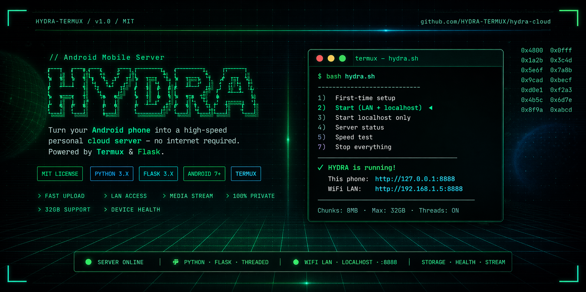
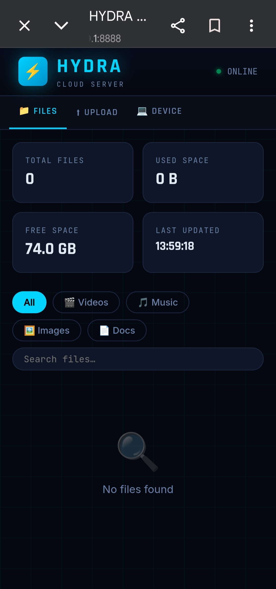
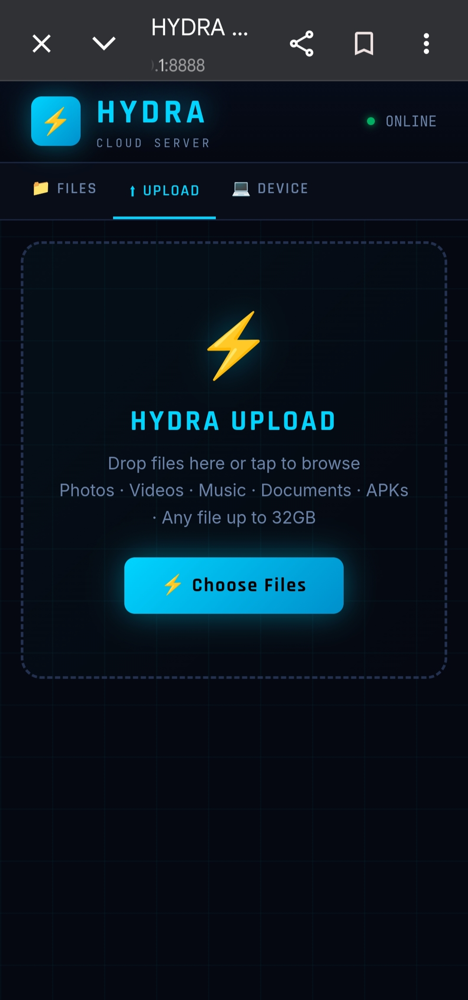
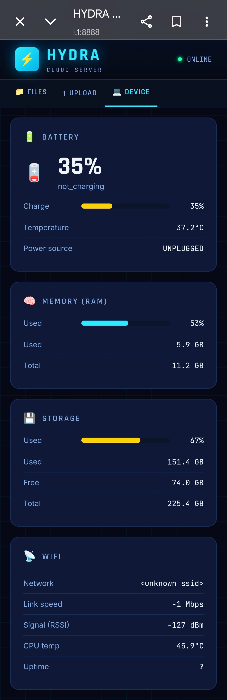
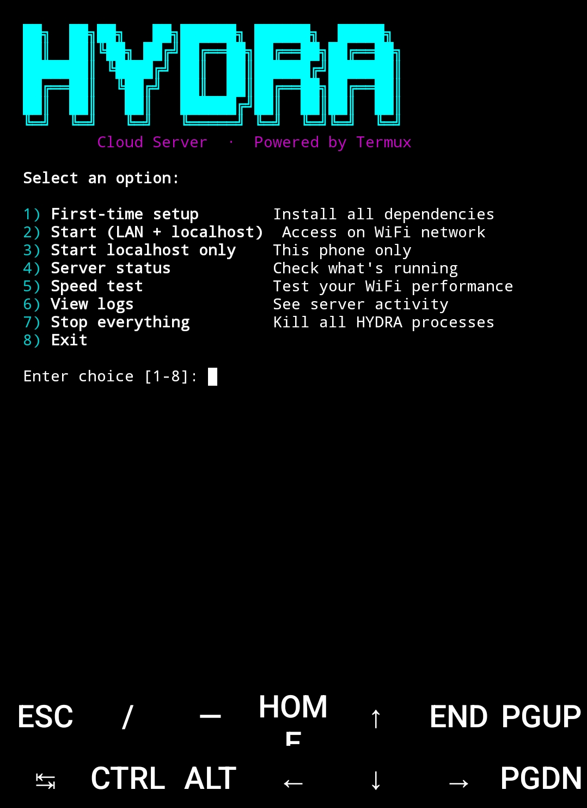

<div align="center">

<!-- HEADER BANNER -->


<br/>

**Turn your Android phone into a high-speed personal cloud server — no internet required.**

[](LICENSE)
[](https://termux.dev)
[](https://python.org)
[](https://flask.palletsprojects.com)
[](https://android.com)

</div>

---

## What is HYDRA?

**HYDRA Cloud Server** runs entirely on your Android phone via [Termux](https://termux.dev). It spins up a beautiful web UI accessible from any browser on your local WiFi network — laptop, tablet, or another phone. No cloud accounts. No subscriptions. No data leaving your home.

> Upload, download, stream videos & music, and monitor your phone's health — all from a slick dark-themed web interface.

---

## Features

| Feature | Description |
|--------|-------------|
| 📤 **Fast Upload** | Drag-and-drop with 8MB chunk streaming & real-time speed meter |
| 📥 **Download** | One-click download with HTTP range request support |
| 🎬 **Media Streaming** | In-browser video & audio player, image viewer |
| 📊 **Device Health** | Live battery, RAM, storage, WiFi, CPU temp dashboard |
| 🌐 **LAN Access** | Any device on the same WiFi can connect instantly |
| 🔒 **100% Private** | No internet required, no data leaves your network |
| 📱 **Mobile-First UI** | Responsive dark UI, works on any screen size |
| ⚡ **High Performance** | Threaded Flask, 8MB chunks, up to 32GB file support |

---

## Repository Structure

```
hydra-cloud/
├── hydra_server.py               # Flask web server — the core engine
├── hydra.sh                      # Termux launcher & setup menu
├── docs/
│   ├── INSTALL.md                # Detailed installation guide
│   ├── USAGE.md                  # Full usage reference
│   └── TROUBLESHOOTING.md        # Common issues & fixes
├── screenshots/
│   ├── architecture.svg          # System architecture diagram
│   ├── menu.png                  # Terminal menu
│   ├── files.png                 # Files tab UI
│   ├── upload.png                # Upload tab UI
│   └── health.png                # Device health dashboard
├── .github/
│   ├── ISSUE_TEMPLATE/
│   │   ├── bug_report.md
│   │   └── feature_request.md
│   └── CONTRIBUTING.md
├── .gitignore
├── LICENSE
└── README.md
```

---

## Quick Start

### 1 — Install Termux
Download **[Termux from F-Droid](https://f-droid.org/packages/com.termux/)** — do not use the Play Store version.

### 2 — Clone & run
```bash
pkg install git -y
git clone https://github.com/YOUR_USERNAME/hydra-cloud
cd hydra-cloud
chmod +x hydra.sh
bash hydra.sh
```

### 3 — First-time setup (option `1`)
The setup installs Python, Flask, and all dependencies automatically.

### 4 — Start the server (option `2`)
```
  HYDRA is running on your network!

  This phone:   http://127.0.0.1:8888
  WiFi LAN:     http://192.168.X.XXX:8888
```

### 5 — Open in any browser
Navigate to the **WiFi LAN** address shown in Termux from any device on the same network.

---

## Menu Reference

```
  1) First-time setup        Install all dependencies
  2) Start (LAN + localhost) Access on WiFi network
  3) Start localhost only    This phone only
  4) Server status           Check what's running
  5) Speed test              Test your WiFi performance
  6) View logs               See server activity
  7) Stop everything         Kill all HYDRA processes
  8) Exit
```

---

## Architecture

```
Your Phone (Termux)                      Any Device on LAN
┌──────────────────────┐                ┌───────────────────┐
│                      │                │                   │
│  hydra.sh            │                │  Chrome / Firefox │
│  (Launcher menu)     │   WiFi LAN     │  http://192.168   │
│         │            │◄──────────────►│       .x.x:8888   │
│         ▼            │                │                   │
│  hydra_server.py     │                │  • Upload files   │
│  (Flask on :8888)    │                │  • Download files │
│         │            │                │  • Stream media   │
│         ▼            │                │  • View health    │
│  ~/storage/shared/   │                └───────────────────┘
│  HYDRACloud/         │
└──────────────────────┘
```

See the full [architecture diagram](screenshots/architecture.svg).

**Key technical details:**
- **8MB streaming chunks** — maximises WiFi throughput
- **HTTP Range requests** — enables seek & resume in video players
- **Threaded Flask** — simultaneous upload + download + streaming
- **32GB max file size** — handles any file you throw at it
- **Wake lock** — keeps server alive when screen is off

---

## Screenshots

<table>
  <tr>
    <td align="center"><b>📁 Files Browser</b></td>
    <td align="center"><b>📤 Upload Interface</b></td>
  </tr>
  <tr>
    <td></td>
    <td></td>
  </tr>
  <tr>
    <td align="center"><b>📊 Device Health</b></td>
    <td align="center"><b>🖥️ Terminal Menu</b></td>
  </tr>
  <tr>
    <td></td>
    <td></td>
  </tr>
</table>

---

## Demo Video

[](https://youtube.com/YOUR_VIDEO_ID)

> Full walkthrough: setup, file upload, video streaming, device health dashboard.

---

## Requirements

| Requirement | Details |
|------------|---------|
| **Device** | Any Android phone or tablet |
| **Android** | 7.0 (API 24) or newer |
| **App** | [Termux via F-Droid](https://f-droid.org/packages/com.termux/) |
| **Storage** | Grant Termux storage access when prompted |
| **Network** | WiFi (for LAN access from other devices) |
| **Python + Flask** | Installed automatically by setup (option 1) |

---

## Configuration

Edit variables at the top of `hydra.sh` to customise:

```bash
PORT=8888                                        # Change the server port
UPLOAD_DIR="$HOME/storage/shared/HYDRACloud"    # Change the storage folder
```

In `hydra_server.py`:
```python
CHUNK_SIZE = 8 * 1024 * 1024           # Upload chunk size (default 8MB)
app.config['MAX_CONTENT_LENGTH'] = 32 * 1024 * 1024 * 1024   # Max file size (32GB)
```

---

## API Endpoints

| Method | Endpoint | Description |
|--------|----------|-------------|
| `GET` | `/` | Main web UI |
| `GET` | `/api/files` | JSON list of all files |
| `GET` | `/api/health` | Device health stats as JSON |
| `POST` | `/upload` | Upload a file (multipart/form-data) |
| `GET` | `/download/<filename>` | Download a file |
| `GET` | `/stream/<filename>` | Stream with HTTP range support |
| `DELETE` | `/delete/<filename>` | Delete a file |

---

## Security Notes

HYDRA is designed for **trusted local networks** (your home WiFi) only.

- No authentication is implemented by default
- Do **not** expose port 8888 to the internet or forward it on your router
- On untrusted networks, use **localhost only** mode (option 3)

---

## Contributing

Contributions are welcome! See [CONTRIBUTING.md](.github/CONTRIBUTING.md).

1. Fork the repository
2. Create a branch: `git checkout -b feature/your-feature`
3. Commit: `git commit -m 'Add your feature'`
4. Push: `git push origin feature/your-feature`
5. Open a Pull Request

---

## License

MIT License — see [LICENSE](LICENSE) for details.

---

## Acknowledgements

- [Termux](https://termux.dev) — the Android terminal that makes this possible
- [Flask](https://flask.palletsprojects.com) — lightweight Python web framework
- Built with ❤️ for anyone who wants their phone to do more

---

<div align="center">

**If HYDRA is useful, please ⭐ star the repo!**

</div>
